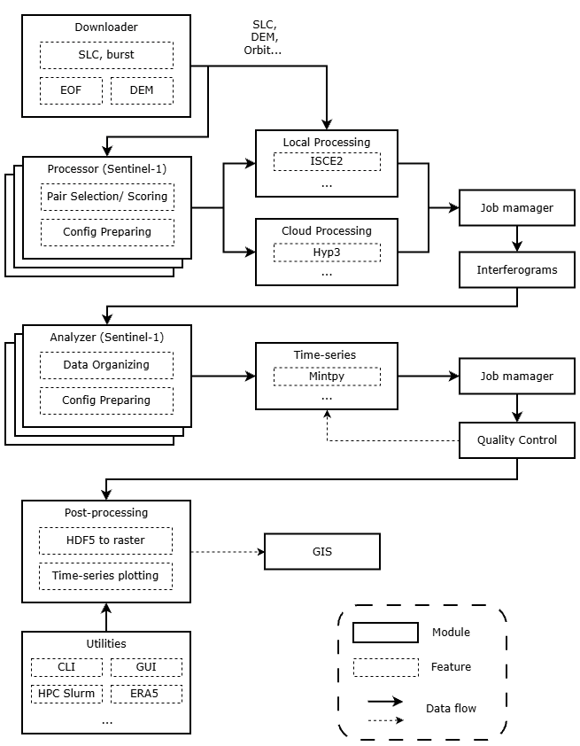

# Program Structure

InSARHub is built around three loosely-coupled layers — **Downloader**, **Processor**, and **Analyzer** — each implemented as a registry of named backends. A shared `insarhub_config.json` written to the job folder accumulates configuration as the pipeline progresses, so every stage can be run independently or chained together.

- **Downloader** — searches ASF for scenes, selects interferogram pairs with quality scoring, and fetches SLC data and orbit files.
- **Processor** — takes the selected pairs and produces geocoded interferograms, either via cloud (HyP3) or local/HPC (ISCE2).
- **Analyzer** — ingests the interferogram stack into MintPy and runs SBAS time-series analysis through to velocity and displacement maps.

The Web UI and CLI are thin shells over the same Python API, so any workflow that runs in the browser can be reproduced exactly on the command line or in a script.

{: .doc-img-wide }
