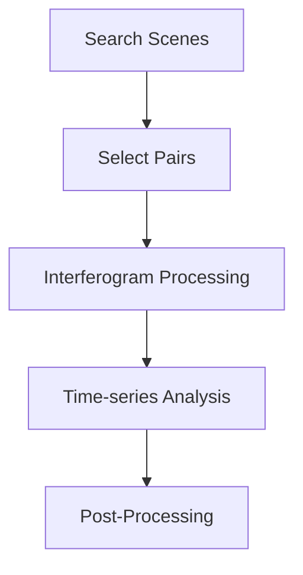

The InSARHub CLI (`insarhub`) exposes the full processing pipeline — search, process, analyze, and utility tools — as a single command-line program suitable for both interactive use and HPC batch submission.

```bash
insarhub <command> [options]
```

Use `-v` / `--version` to check the installed version, and `--help` on any command or sub-action for inline reference:

```bash
insarhub --version
insarhub --help
insarhub downloader --help
insarhub analyzer run --help
```

## Workflow

<div style="text-align: center;">

</div>

---

## downloader

Search for satellite scenes and optionally select interferogram pairs or download data.

```bash
insarhub downloader [options]
```

### Downloader selection

| Flag | Default | Description |
|------|---------|-------------|
| `-N`, `--name` | `S1_SLC` | Downloader to use (see `--list-downloaders`) |
| `--list-downloaders` | — | Print all registered downloaders and exit |
| `--list-options` | — | Print all config fields for the selected downloader |
| `-w`, `--workdir` | cwd | Working directory |
| `--config` | `<workdir>/insarhub_config.json` | Path to a saved downloader config JSON; omit the value to use the default path |

```bash
# List available downloaders
insarhub downloader --list-downloaders

# List all config fields for S1_SLC (reads saved config if present)
insarhub downloader -N S1_SLC --list-options
```

After the first run, an `insarhub_config.json` is written to `workdir` with the full resolved config. On subsequent runs, this file is automatically loaded as defaults — so you only need to specify what changed:

```bash
# First run: full options required
insarhub downloader -N S1_SLC --AOI -113.05 37.74 -112.68 38.00 \
    --start 2020-01-01 --end 2020-12-31 --stacks 100:466 -w /data/bryce

# Subsequent run: config reloaded from /data/bryce/insarhub_config.json
insarhub downloader -N S1_SLC -w /data/bryce

# Use a different config file
insarhub downloader -w /data/bryce --config /other/path/my_config.json

# Load default config path without specifying a value
insarhub downloader -N S1_SLC --config
```

Any config field shown by `--list-options` can be set directly as an extra flag:

```bash
insarhub downloader -N S1_SLC --start 2020-01-01 --end 2020-12-31 \
    --relativeOrbit 100 --frame 466
```

### Area of Interest

| Flag | Description |
|------|-------------|
| `--AOI` | Bounding box as `minlon minlat maxlon maxlat`, a GeoJSON/shapefile path, or a WKT string |
| `--stacks` | Restrict to specific track/frame stacks as `PATH:FRAME` tokens |

```bash
# Bounding box
insarhub downloader --AOI -113.05 37.74 -112.68 38.00

# Specific stacks (takes precedence over --relativeOrbit / --frame)
insarhub downloader --stacks 100:466 20:118
```

### Pair selection

Add `--select-pairs` to run interferogram pair selection after search. Results are saved as `stack_p<path>_f<frame>.json` inside a `p<path>_f<frame>/` subfolder under `workdir`, alongside an `insarhub_config.json` with the downloader settings. One file per track/frame group. Pass `--merge` (see [Merging multiple frames](#merging-multiple-frames)) to combine same-path frames into one pairing network instead.

| Flag | Default | Description |
|------|---------|-------------|
| `--select-pairs` | — | Select pairs after search |
| `--dt-targets` | `6 12 24 36 48 72 96` | Target temporal spacings in days |
| `--dt-tol` | `3` | Tolerance in days around each target |
| `--dt-max` | `120` | Maximum temporal baseline (days) |
| `--pb-max` | `150.0` | Maximum perpendicular baseline (m) |
| `--min-degree` | `3` | Minimum connections per scene |
| `--max-degree` | `5` | Maximum connections per scene |
| `--force-connect` / `--no-force-connect` | enabled | Force connectivity for isolated scenes |
| `--sp-workers` | `8` | Threads for API baseline fallback |
| `--avoid-low-quality-days` / `--no-avoid-low-quality-days` | enabled | Exclude scenes with heavy rain or snow cover |
| `--precip-mm-threshold` | `25.0` | 3-day precipitation threshold (mm) above which a scene is excluded |
| `--snow-threshold` | `0.5` | MODIS snow-cover fraction (0–1) above which a scene is excluded |
| `--pairs-output` | `<workdir>/pairs.json` | Output file path |

```bash
insarhub downloader -N S1_SLC \
    --AOI -113.05 37.74 -112.68 38.00 \
    --start 2020-01-01 --end 2020-12-31 \
    --stacks 100:466 \
    --select-pairs --dt-max 96 --pb-max 150
```

### Download

| Flag | Default | Description |
|------|---------|-------------|
| `-d`, `--download` | — | Download scenes after search |
| `-O`, `--orbit-files [PATH]` | — | Download orbit files. Omit `PATH` to save alongside scenes (one subfolder per stack); provide `PATH` to collect all orbit files into that directory |
| `--merge` | — | Combine all frames sharing one relative orbit (path) into a single stack — see [Merging multiple frames](#merging-multiple-frames) below |
| `--worker` | `3` | Parallel download workers |
| `--no-verify-ssl` | — | Disable SSL certificate verification for ASF downloads. Use this if ASF's certificate has expired and downloads fail with an SSL error |
| `--footprint` | `<workdir>/footprint.png` | Save a footprint map image to this path |

```bash
# Search, select pairs, and download with orbit files saved per-stack
insarhub downloader -N S1_SLC \
    --AOI -113.05 37.74 -112.68 38.00 \
    --start 2020-01-01 --end 2020-12-31 \
    --select-pairs --download -O \
    --footprint footprint.png

# Save all orbit files to a specific directory
insarhub downloader -N S1_SLC \
    --AOI -113.05 37.74 -112.68 38.00 \
    --start 2020-01-01 --end 2020-12-31 \
    --download -O orbits/

# Download orbit files only (no scene download)
insarhub downloader -N S1_SLC \
    --AOI -113.05 37.74 -112.68 38.00 \
    --start 2020-01-01 --end 2020-12-31 \
    -O orbits/
```

### Merging multiple frames

When a study area spans several ASF frame numbers on the *same* relative orbit — e.g. one frame has gaps or is otherwise unusable and needs a neighboring frame to fill the AOI — pass `--merge` to `--select-pairs` and `--download` together. Interferometric pairing is only physically meaningful within one track: two acquisitions from different relative orbits have unrelated viewing geometry and can never be paired, so `--merge` requires every returned stack to share one path and raises an error otherwise.

```bash
insarhub downloader -N S1_SLC \
    --AOI -113.20 37.74 -112.50 38.10 \
    --start 2020-01-01 --end 2020-12-31 \
    --select-pairs --download -O --merge
```

Multiple frames sharing one calendar acquisition date (i.e. one orbital pass split across ASF frame boundaries) are treated as a single acquisition for pair selection — matching how ISCE2's `stackSentinel` merges same-date SLCs internally. Output lands in `p<path>_merged_f<frame1>_f<frame2>_.../` — the frame numbers are baked into the folder name so two independent merge groups on the same path (e.g. two different sub-areas of one track) never collide with each other.

---

## processor

Submit interferogram pairs to a processing backend and manage the job lifecycle.

```bash
insarhub processor [--list-processors] <action> [options]
```

| Flag | Description |
|------|-------------|
| `--list-processors` | Print all registered processors and exit |

=== "Hyp3_S1"

    Cloud processing via ASF HyP3 — no local ISCE2 needed.

    #### submit

    Submit interferogram pairs to ASF HyP3 for cloud processing.

    ```bash
    insarhub processor submit [options]
    ```

    | Flag | Default | Description |
    |------|---------|-------------|
    | `-N`, `--name` | `Hyp3_S1` | Must be `Hyp3_S1` (default) |
    | `--list-options` | — | Print all config fields |
    | `-w`, `--workdir` | cwd | Working directory |
    | `--config` | `<workdir>/insarhub_config.json` | Path to saved config; omit value to use default path |
    | `--credential-pool` | `~/.credit_pool` | Path to a plain-text file with one `username:password` per line for multi-account submission |
    | `--name-prefix` | `ifg` | Job name prefix |
    | `--worker` | `4` | Parallel submission workers |
    | `--dry-run` | — | Print what would be submitted without sending jobs |
    | `--pairs-file` | auto | Pairs JSON from `downloader --select-pairs` |
    | `--pairs` | — | Inline pairs as `"reference,secondary"` strings |

    After submission, settings are saved to `insarhub_config.json`. Subsequent runs reload it automatically — only specify overrides:

    ```bash
    # First submission
    insarhub processor submit -N Hyp3_S1 -w /data/bryce

    # Dry run (recommended before first real submission)
    insarhub processor submit -N Hyp3_S1 -w /data/bryce --dry-run

    # Override a field and resubmit
    insarhub processor submit -N Hyp3_S1 -w /data/bryce --phase_filter_parameter 0.5 --dry-run

    # Auto-detect pairs from p*_f* subfolders
    insarhub processor submit -w /data/bryce --dry-run

    # Specific pairs file
    insarhub processor submit -w /data/bryce --pairs-file /data/pairs.json

    # Inline pairs
    insarhub processor submit -w /data/bryce --pairs "S1A_20200101,S1A_20200113"
    ```

    When no `--pairs-file` is given, `submit` automatically looks for `stack_p<path>_f<frame>.json` files inside `p<path>_f<frame>/` subfolders under `workdir` (the layout produced by `downloader --select-pairs`).

    #### refresh

    Pull latest job statuses from HyP3.

    | Flag | Default | Description |
    |------|---------|-------------|
    | `-w`, `--workdir` | cwd | Working directory |
    | `--job-file` | `<workdir>/hyp3_jobs.json` | Path to saved job IDs JSON |
    | `-r`, `--recursive` | off | Recursively search workdir for all `hyp3*.json` files (including retry files) |

    ```bash
    insarhub processor refresh -w /data/bryce
    insarhub processor refresh -w /data/bryce -r   # search all subdirs including retry files
    ```

    #### download

    Download all completed HyP3 outputs.

    | Flag | Default | Description |
    |------|---------|-------------|
    | `-w`, `--workdir` | cwd | Working directory |
    | `--job-file` | `<workdir>/hyp3_jobs.json` | Path to saved job IDs JSON |
    | `--worker` | saved config | Parallel download threads (overrides saved config) |
    | `-r`, `--recursive` | off | Recursively search workdir for all `hyp3*.json` files (including retry files) |

    ```bash
    insarhub processor download -w /data/bryce
    insarhub processor download -w /data/bryce -r --worker 8
    ```

    #### retry

    Resubmit all failed HyP3 jobs.

    | Flag | Default | Description |
    |------|---------|-------------|
    | `-w`, `--workdir` | cwd | Working directory |
    | `--job-file` | auto | Saved job file |
    | `-r`, `--recursive` | off | Recursively search workdir for all `hyp3*.json` files (including retry files) |

    ```bash
    insarhub processor retry -w /data/bryce
    insarhub processor retry -w /data/bryce -r
    ```

    #### watch

    Poll HyP3 at regular intervals; downloads results as jobs succeed.

    | Flag | Default | Description |
    |------|---------|-------------|
    | `--interval` | `300` | Seconds between polls |
    | `-w`, `--workdir` | cwd | Working directory |
    | `--worker` | saved config | Parallel download threads (overrides saved config) |
    | `-r`, `--recursive` | off | Recursively search workdir for all `hyp3*.json` files (including retry files) |

    ```bash
    insarhub processor watch -w /data/bryce --interval 600
    insarhub processor watch -w /data/bryce --interval 600 -r
    insarhub processor watch -w /data/bryce --worker 8
    ```

    #### credits

    Show remaining HyP3 processing credits for all accounts.

    | Flag | Default | Description |
    |------|---------|-------------|
    | `--credential-pool` | `~/.credit_pool` | Path to a plain-text file with one `username:password` per line for multiple accounts |

    ```bash
    insarhub processor credits
    insarhub processor credits --credential-pool ~/.credit_pool
    ```

=== "ISCE_S1"

    Local or HPC processing using ISCE2 `stackSentinel` — requires ISCE2 installed. SLC `.SAFE` files must be downloaded first (use `insarhub downloader -d`).

    #### submit

    Generate ISCE2 run scripts and start execution.

    ```bash
    insarhub processor submit -N ISCE_S1 [options]
    ```

    | Flag | Default | Description |
    |------|---------|-------------|
    | `-N`, `--name` | — | Must be `ISCE_S1` |
    | `--list-options` | — | Print all config fields |
    | `-w`, `--workdir` | cwd | Working directory |
    | `--config` | `<workdir>/insarhub_config.json` | Path to saved config |
    | `--bbox` | — | Bounding box `S N W E` in decimal degrees |
    | `--slc_dir` | `<workdir>/slc` | Directory containing SLC `.SAFE` files |
    | `--orbit_dir` | `<workdir>/slc` | Directory containing `.EOF` orbit files |
    | `--hpc_mode` | `False` | Submit each step as a separate SLURM `sbatch` job |
    | `--max_concurrent_hpc` | `12` | Maximum number of child jobs running in parallel per step |
    | `--coregistration` | `NESD` | `NESD` (recommended) or `geometry` |
    | `--looks_range` | `20` | Range looks |
    | `--looks_azimuth` | `4` | Azimuth looks |
    | `--step` | all | Force (re)run only these step(s), regardless of saved status — see below |
    | `--dry-run` | — | Preview run scripts and path checks without executing |
    | `--pairs-file` | auto | Pairs JSON from `downloader --select-pairs` |
    | `--container` | — | Run inside a container instead of on the host — see [Running without a local ISCE2 install](#running-without-a-local-isce2-install) below |

    ```bash
    # Dry run first (recommended)
    insarhub processor submit -N ISCE_S1 -w /data/p100_f466 \
        --bbox 33.0 38.0 -120.0 -115.0 --dry-run

    # Local execution (runs in background)
    insarhub processor submit -N ISCE_S1 -w /data/p100_f466 \
        --bbox 33.0 38.0 -120.0 -115.0

    # HPC / SLURM mode
    insarhub processor submit -N ISCE_S1 -w /data/p100_f466 \
        --bbox 33.0 38.0 -120.0 -115.0 --hpc_mode True
    ```

    !!! note "Force-rerun specific step(s) with `--step`"
        A normal `submit` skips any step already `SUCCEEDED`; `retry` re-runs from the first `FAILED` step onward, cascading into every step after it. `--step` is narrower than both: it forces only the named step(s) back to `PENDING` and re-runs them, leaving every other step exactly as it is — no cascade. Useful when a specific step silently produced bad output (recorded as `SUCCEEDED`) and only that one needs to be redone.

        Accepts the full step name, just its number, or a `run_NN` prefix:

        ```bash
        # Force step 03 to re-run — equivalent forms
        insarhub processor submit -N ISCE_S1 -w /data/p100_f466 --step 03
        insarhub processor submit -N ISCE_S1 -w /data/p100_f466 --step 3
        insarhub processor submit -N ISCE_S1 -w /data/p100_f466 --step run_03

        # Force multiple steps
        insarhub processor submit -N ISCE_S1 -w /data/p100_f466 --step 03 04 05
        ```

        In HPC mode this also clears stale per-command `.done`/`.fail` markers for the forced step(s) — otherwise the manager script would see old markers and report "already done" without submitting anything.

    !!! note "HPC mode — sliding-window manager"
        When `--hpc_mode True` is set, each processing step runs as a lightweight SLURM **manager job**. The manager keeps at most `--max_concurrent_hpc` child jobs active at any time, submitting new ones immediately when a slot opens. Steps are chained via `--dependency=afterok` so they run sequentially. Consecutive steps with the same number of commands are merged into a single group-manager job automatically.

        Each sbatch script logs `START`, `DONE`, and `FAIL` lines with elapsed seconds per command.

        **`sbatch_options.json`** — loaded automatically from `<workdir>/sbatch_options.json` to configure per-step SLURM resources (CPUs, memory, walltime, partition, etc.). Steps `"01"`–`"16"` are `ISCE_S1`'s own steps; step `"17"` ("SBAS") configures the `ISCE_SBAS`/`Hyp3_SBAS` analyzer's own `--hpc_mode` job (see [analyzer HPC mode](#hpc-mode)) — one file, shared by both processor and analyzer, since they typically run against the same workdir.

        - If `sbatch_options.json` is **not found**, a default template covering steps `01`–`17` is created and `submit` prints a reminder to edit it before resubmitting.
        - If the file exists but is missing a step you're about to use (e.g. `"17"` the first time you run the analyzer in HPC mode), it's added automatically with default resources, the file is rewritten, and a warning is printed — review the added defaults before relying on them.
        - If `srun_options.json` exists from an older run, it is migrated to `sbatch_options.json` automatically.

        Edit `sbatch_options.json` to set resources per step, then re-run `submit`.

    !!! note "Running without a local ISCE2 install"
        `--container <path-or-image>` re-invokes the entire `insarhub processor ...` command inside a container instead of the host — pass a path to an Apptainer/Singularity `.sif` image, or a Docker image reference (name[:tag]). The workdir is bind-mounted into the container at the identical path, so output files land on the host exactly like a native run, and `ISCE_S1` never needs to discover a host ISCE2 install at all. The container image just needs `insarhub` installed alongside ISCE2/topsStack — see [`Dockerfile`](https://github.com/jldz9/InSARHub/blob/main/Dockerfile) in the repo root for a ready-to-build example.

        ```bash
        insarhub processor submit  -N ISCE_S1 -w /data/p100_f466 --bbox 33.0 38.0 -120.0 -115.0 --container ghcr.io/jldz9/insarhub-isce2:latest
        insarhub processor refresh -N ISCE_S1 -w /data/p100_f466 --container ghcr.io/jldz9/insarhub-isce2:latest
        insarhub processor retry   -N ISCE_S1 -w /data/p100_f466 --container ghcr.io/jldz9/insarhub-isce2:latest
        insarhub processor watch   -N ISCE_S1 -w /data/p100_f466 --container ghcr.io/jldz9/insarhub-isce2:latest
        insarhub processor cancel  -N ISCE_S1 -w /data/p100_f466 --container ghcr.io/jldz9/insarhub-isce2:latest
        ```

        `--container` is a per-invocation flag, not a saved setting — like `--dry-run`, it's never written to `insarhub_config.json`, so pass it again on every `submit`/`refresh`/`retry`/`watch`/`cancel` call you want to run inside the container.

    #### refresh

    Read step and command statuses from disk.

    | Flag | Default | Description |
    |------|---------|-------------|
    | `-w`, `--workdir` | cwd | Working directory |
    | `--job-file` | auto | `<workdir>/isce/isce_jobs_*.json` |
    | `--ls [STEP]` | off | Show per-command (`cmd_XXXX`) detail — bare `--ls` for every step, `--ls 03` (also `3` or `run_03`) for just one step |
    | `--container` | — | Needed if the host has no local ISCE2 install — see [below](#running-without-a-local-isce2-install) |

    ```bash
    insarhub processor refresh -N ISCE_S1 -w /data/p100_f466
    ```

    By default only the one-line-per-step summary prints — no `cmd_XXXX` detail:

    ??? output
        ```
          STEP                                          STATUS
        -----------------------------------------------------------------
          - run_01_unpack_topo_reference                SUCCEEDED
          - run_02_unpack_secondary_slc                 RUNNING
          - run_03_average_baseline                     PENDING
          ...
        ```

    Pass `--ls` to also see per-command detail — for every step, or a specific one:

    ```bash
    insarhub processor refresh -N ISCE_S1 -w /data/p100_f466 --ls        # every step
    insarhub processor refresh -N ISCE_S1 -w /data/p100_f466 --ls 02     # just run_02
    ```

    ??? output
        ```
          STEP                                          STATUS
        -----------------------------------------------------------------
          - run_01_unpack_topo_reference                SUCCEEDED
          - run_02_unpack_secondary_slc                 RUNNING
              cmd_0000  SUCCEEDED
              cmd_0001  RUNNING
              cmd_0002  PENDING
          - run_03_average_baseline                     PENDING
          ...
        ```

    #### retry

    Re-run all failed steps. HPC mode is detected automatically from saved job metadata — no need to pass `--hpc_mode` again.

    | Flag | Default | Description |
    |------|---------|-------------|
    | `-w`, `--workdir` | cwd | Working directory |
    | `--job-file` | auto | Saved job file |
    | `--container` | — | Needed if the host has no local ISCE2 install — see [below](#running-without-a-local-isce2-install) |

    ```bash
    insarhub processor retry -N ISCE_S1 -w /data/p100_f466
    ```

    #### cancel

    Terminate running steps. Local mode sends SIGTERM to the background process; HPC mode runs `scancel` on all active SLURM job IDs.

    | Flag | Default | Description |
    |------|---------|-------------|
    | `-w`, `--workdir` | cwd | Working directory |
    | `--job-file` | auto | Saved job file |
    | `--container` | — | Needed if the host has no local ISCE2 install — see [below](#running-without-a-local-isce2-install) |

    ```bash
    insarhub processor cancel -N ISCE_S1 -w /data/p100_f466
    ```

    #### watch

    Poll step statuses until all steps complete.

    | Flag | Default | Description |
    |------|---------|-------------|
    | `--interval` | `300` | Seconds between polls |
    | `-w`, `--workdir` | cwd | Working directory |
    | `--container` | — | Needed if the host has no local ISCE2 install — see [below](#running-without-a-local-isce2-install) |

    ```bash
    insarhub processor watch -N ISCE_S1 -w /data/p100_f466 --interval 120
    ```

---

## analyzer

Run MintPy SBAS time-series analysis on interferogram outputs.

```bash
insarhub analyzer [-N ANALYZER] [-w WORKDIR] [config overrides] <action> [options]
```

| Flag | Default | Description |
|------|---------|-------------|
| `-N`, `--name` | `Hyp3_SBAS` | Analyzer to use (`Hyp3_SBAS` or `ISCE_SBAS`) |
| `-w`, `--workdir` | cwd | Working directory |
| `--list-analyzers` | — | Print all registered analyzers and exit |
| `--list-options` | — | Print all config fields for the selected analyzer |

| Analyzer | Processor | Input |
|---|---|---|
| `Hyp3_SBAS` | [`Hyp3_S1`](#hyp3_s1) | HyP3 zip outputs |
| `ISCE_SBAS` | [`ISCE_S1`](#isce_s1) | ISCE2 `merged/interferograms/` |

Any field shown by `--list-options` can be overridden on the command line before the action. Values are written into `mintpy.cfg` and persist across runs. If `workdir` contains multiple `p*_f*` subfolders, overrides and analysis are applied to each in sequence.

=== "Hyp3_SBAS"

    ### run

    Run the analysis workflow. Omitting `--step` runs the full pipeline (`prep_data` + all MintPy steps).

    ```bash
    insarhub analyzer -N Hyp3_SBAS -w /data/bryce run [--step STEP...] [--debug]
    ```

    | Flag | Default | Description |
    |------|---------|-------------|
    | `--step` | all | Step(s) to run (space-separated) |
    | `--debug` | — | Enable MintPy debug mode |
    | `--hpc_mode` | `False` | Submit the full MintPy run as a single SLURM `sbatch` job instead of running locally |
    | `--container` | — | Run inside a container instead of on the host — needs `insarhub` installed alongside MintPy (and ISCE2, for `ISCE_SBAS`); see [ISCE_S1's container note](#running-without-a-local-isce2-install) for the same mechanism |

    | Step keyword | Description |
    |---|---|
    | `prep_data` | Unzip and clip HyP3 products, write MintPy config |
    | `all` | `prep_data` + all MintPy steps (default) |
    | `load_data` | Load interferograms and geometry into MintPy HDF5 |
    | `modify_network` | Apply network modification rules |
    | `reference_point` | Select reference pixel |
    | `quick_overview` | Generate diagnostic overview layers (coherence, phase velocity, unwrapping errors, connected component mask) |
    | `correct_unwrap_error` | Correct phase-unwrapping errors |
    | `invert_network` | Invert the interferogram network (SBAS) |
    | `correct_LOD` | Correct for local oscillator drift |
    | `correct_SET` | Correct for solid Earth tides |
    | `correct_ionosphere` | Correct ionospheric delay |
    | `correct_troposphere` | Correct tropospheric delay |
    | `deramp` | Remove orbital/ramp signal |
    | `correct_topography` | Correct topographic residuals |
    | `residual_RMS` | Compute residual RMS for outlier detection |
    | `reference_date` | Select reference date |
    | `velocity` | Estimate linear velocity |
    | `geocode` | Geocode outputs to geographic coordinates |
    | `google_earth` | Generate Google Earth KMZ |
    | `hdfeos5` | Export to HDF-EOS5 format |
    | `plot` | (Re)generate figures under `mintpy/pic/`. Not a real MintPy step — handled specially. Auto-added whenever more than one real step above is requested (or the full `all` pipeline), matching MintPy's own CLI behavior; also usable standalone (e.g. to re-plot after a config change without recomputing anything) |

    ```bash
    # Full pipeline
    insarhub analyzer -N Hyp3_SBAS -w /data/bryce run

    # Prep only
    insarhub analyzer -N Hyp3_SBAS -w /data/bryce run --step prep_data

    # Single step
    insarhub analyzer -N Hyp3_SBAS -w /data/bryce run --step velocity

    # Multiple steps
    insarhub analyzer -N Hyp3_SBAS -w /data/bryce run --step geocode velocity

    # Override config and run
    insarhub analyzer -N Hyp3_SBAS -w /data/bryce --compute_maxMemory 30 run
    ```

    Each executing step prints `Step N/Total: step_name` for batch log visibility.

    #### HPC mode

    When `--hpc_mode True` is set, a single `sbatch` script covering all selected steps is generated and submitted to SLURM instead of running locally.

    ```bash
    insarhub analyzer -N Hyp3_SBAS -w /data/bryce run --hpc_mode True

    # Specific steps on HPC
    insarhub analyzer -N Hyp3_SBAS -w /data/bryce run --hpc_mode True --step velocity geocode
    ```

    Script written to `<workdir>/mintpy/mintpy_sbas.sbatch`, job state to `mintpy/mintpy_job.json`.

    SLURM resources come from `<workdir>/sbatch_options.json`, step key `"17"` — the **same file** used by `ISCE_S1 submit --hpc_mode` (steps `01`–`16`), since processor and analyzer typically share one workdir. Default: `time=24:00:00`, `ntasks=1`, `cpus_per_task=16`, `mem=128G`, `partition=all`.

    - If `sbatch_options.json` doesn't exist yet, it's created (covering steps `01`–`17`) and the run stops so you can review it before resubmitting.
    - If the file exists but has no `"17"` entry, it's added automatically with the defaults above, a warning is printed, and the run proceeds.

    Edit step `"17"` in `sbatch_options.json` to change resources, then re-run:

    ```bash
    insarhub analyzer -N Hyp3_SBAS -w /data/bryce run --hpc_mode True
    ```

    ### cleanup

    Remove intermediate files no longer needed after MintPy has loaded all data into HDF5.

    ```bash
    insarhub analyzer -N Hyp3_SBAS -w /data/bryce cleanup
    ```

    | Flag | Description |
    |------|-------------|
    | `--debug` | Dry-run — print what would be removed without deleting |

    Removes: `tmp/`, `clip/`, all `.zip` files in workdir.

=== "ISCE_SBAS"

    ### run

    Run the analysis workflow. Omitting `--step` runs the full pipeline (`prep_data` + all MintPy steps).

    ```bash
    insarhub analyzer -N ISCE_SBAS -w /data/p100_f466 run [--step STEP...] [--debug]
    ```

    | Flag | Default | Description |
    |------|---------|-------------|
    | `--step` | all | Step(s) to run (space-separated) |
    | `--debug` | — | Enable MintPy debug mode |
    | `--hpc_mode` | `False` | Submit the full MintPy run as a single SLURM `sbatch` job instead of running locally |
    | `--container` | — | Run inside a container instead of on the host — needs `insarhub` installed alongside MintPy (and ISCE2, for `ISCE_SBAS`); see [ISCE_S1's container note](#running-without-a-local-isce2-install) for the same mechanism |

    | Step keyword | Description |
    |---|---|
    | `prep_data` | Auto-discover ISCE2 outputs, write MintPy config |
    | `all` | `prep_data` + all MintPy steps (default) |
    | `load_data` | Load interferograms and geometry into MintPy HDF5 |
    | `modify_network` | Apply network modification rules |
    | `reference_point` | Select reference pixel |
    | `quick_overview` | Generate diagnostic overview layers (coherence, phase velocity, unwrapping errors, connected component mask) |
    | `correct_unwrap_error` | Correct phase-unwrapping errors |
    | `invert_network` | Invert the interferogram network (SBAS) |
    | `correct_LOD` | Correct for local oscillator drift |
    | `correct_SET` | Correct for solid Earth tides |
    | `correct_ionosphere` | Correct ionospheric delay |
    | `correct_troposphere` | Correct tropospheric delay |
    | `deramp` | Remove orbital/ramp signal |
    | `correct_topography` | Correct topographic residuals |
    | `residual_RMS` | Compute residual RMS for outlier detection |
    | `reference_date` | Select reference date |
    | `velocity` | Estimate linear velocity |
    | `geocode` | Geocode outputs to geographic coordinates |
    | `google_earth` | Generate Google Earth KMZ |
    | `hdfeos5` | Export to HDF-EOS5 format |
    | `plot` | (Re)generate figures under `mintpy/pic/`. Not a real MintPy step — handled specially. Auto-added whenever more than one real step above is requested (or the full `all` pipeline), matching MintPy's own CLI behavior; also usable standalone (e.g. to re-plot after a config change without recomputing anything) |

    ```bash
    # Full pipeline
    insarhub analyzer -N ISCE_SBAS -w /data/p100_f466 run

    # Prep only
    insarhub analyzer -N ISCE_SBAS -w /data/p100_f466 run --step prep_data

    # Single step
    insarhub analyzer -N ISCE_SBAS -w /data/p100_f466 run --step velocity

    # Multiple steps
    insarhub analyzer -N ISCE_SBAS -w /data/p100_f466 run --step geocode velocity

    # Override config and run
    insarhub analyzer -N ISCE_SBAS -w /data/p100_f466 --compute_maxMemory 30 run
    ```

    Each executing step prints `Step N/Total: step_name` for batch log visibility.

    #### HPC mode

    When `--hpc_mode True` is set, a single `sbatch` script covering all selected steps is generated and submitted to SLURM instead of running locally.

    ```bash
    insarhub analyzer -N ISCE_SBAS -w /data/p100_f466 run --hpc_mode True

    # Specific steps on HPC
    insarhub analyzer -N ISCE_SBAS -w /data/p100_f466 run --hpc_mode True --step velocity geocode
    ```

    Script written to `<workdir>/mintpy/mintpy_sbas.sbatch`, job state to `mintpy/mintpy_job.json`.

    SLURM resources come from `<workdir>/sbatch_options.json`, step key `"17"` — the **same file** used by `ISCE_S1 submit --hpc_mode` (steps `01`–`16`), since processor and analyzer typically share one workdir. Default: `time=24:00:00`, `ntasks=1`, `cpus_per_task=16`, `mem=128G`, `partition=all`.

    - If `sbatch_options.json` doesn't exist yet, it's created (covering steps `01`–`17`) and the run stops so you can review it before resubmitting.
    - If the file exists but has no `"17"` entry, it's added automatically with the defaults above, a warning is printed, and the run proceeds.

    Edit step `"17"` in `sbatch_options.json` to change resources, then re-run:

    ```bash
    insarhub analyzer -N ISCE_SBAS -w /data/p100_f466 run --hpc_mode True
    ```

    ### cleanup

    Remove intermediate files no longer needed after MintPy has loaded all data into HDF5.

    ```bash
    insarhub analyzer -N ISCE_SBAS -w /data/p100_f466 cleanup
    ```

    | Flag | Description |
    |------|-------------|
    | `--debug` | Dry-run — print what would be removed without deleting |

    Removes: `isce/coarse_interferograms/`, `isce/ESD/`, `isce/coreg_secondarys/`, `isce/interferograms/`, `slc/`, `dem/`.

---

## utils

Standalone utility tools for data preparation, pair selection, network visualisation, and HPC job generation.

```bash
insarhub utils <tool> [options]
```

### clip

Clip HyP3 zip file contents to an AOI before running MintPy. Useful when working with scenes that extend well beyond the study area.

```bash
insarhub utils clip -w /data/bryce --aoi -113.05 37.74 -112.68 38.00
insarhub utils clip -w /data/bryce --aoi study_area.geojson
```

| Flag | Default | Description |
|------|---------|-------------|
| `-w`, `--workdir` | cwd | Directory containing HyP3 `.zip` files |
| `--aoi` | required | AOI as `minlon minlat maxlon maxlat` or path to GeoJSON/shapefile |

### h5-to-raster

Convert a MintPy HDF5 output file (e.g. `velocity.h5`) to GeoTIFF.

```bash
insarhub utils h5-to-raster -i velocity.h5
insarhub utils h5-to-raster -i velocity.h5 -o velocity.tif
```

| Flag | Default | Description |
|------|---------|-------------|
| `-i`, `--input` | required | Input HDF5 file |
| `-o`, `--output` | same name as input with `.tif` | Output GeoTIFF path |

### save-footprint

Extract the valid-data footprint polygon from a raster and save it as a vector file.

```bash
insarhub utils save-footprint -i velocity.h5
insarhub utils save-footprint -i velocity.h5 -o footprint.geojson
```

| Flag | Default | Description |
|------|---------|-------------|
| `-i`, `--input` | required | Input raster file |
| `-o`, `--output` | auto-named beside input | Output vector file path |

### slurm

Generate a SLURM batch script for running an `insarhub` pipeline on an HPC cluster.

```bash
insarhub utils slurm \
    --job-name insar_bryce \
    --time 08:00:00 \
    --cpus 16 \
    --mem 64G \
    --partition compute \
    --conda-env insarhub \
    --command "insarhub analyzer -N Hyp3_SBAS -w /data/bryce run" \
    -o bryce.slurm
```

| Flag | Default | Description |
|------|---------|-------------|
| `--job-name` | `insarhub_job` | SLURM job name |
| `--time` | `04:00:00` | Wall-time limit (`HH:MM:SS`) |
| `--partition` | `all` | SLURM partition |
| `--nodes` | `1` | Number of nodes |
| `--ntasks` | `1` | Number of tasks |
| `--cpus` | `8` | CPUs per task |
| `--mem` | `32G` | Memory per node |
| `--gpus` | — | GPU allocation e.g. `1` or `2` |
| `--conda-env` | — | Conda environment to activate |
| `--modules` | — | Space-separated environment modules to load |
| `--mail-user` | — | Email address for job notifications |
| `--mail-type` | `ALL` | When to notify: `BEGIN`, `END`, `FAIL`, or `ALL` |
| `--account` | — | Account to charge resources to |
| `--qos` | — | Quality of Service specification |
| `--command` | required | Shell command to execute inside the job |
| `-o`, `--output` | `job.slurm` | Output script path |

The generated script follows this structure:

```bash
#!/bin/bash
#SBATCH --job-name=insar_bryce
#SBATCH --time=08:00:00
#SBATCH --cpus-per-task=16
#SBATCH --mem=64G
...

source activate insarhub

echo "Starting job on $(date)"
insarhub analyzer -N Hyp3_SBAS -w /data/bryce run
echo "Job finished on $(date)"
```

### era5-download

Download ERA5 pressure-level weather data for MintPy tropospheric correction. Scans a workdir of HyP3 zip files, determines the required acquisition dates and spatial extents automatically, and saves files using MintPy-compatible naming (`ERA5_S*_N*_W*_E*_YYYYMMDD_HH.grb`).

Requires a `~/.cdsapirc` file with your [CDS API](https://cds.climate.copernicus.eu/api-how-to) credentials.

```bash
insarhub utils era5-download -w /data/bryce -o /data/era5
insarhub utils era5-download -w /data/bryce -o /data/era5 --num-processes 5
```

| Flag | Default | Description |
|------|---------|-------------|
| `-w`, `--workdir` | required | Directory containing HyP3 zip files (scanned per subfolder) |
| `-o`, `--output` | required | Output directory for ERA5 `.grb` files |
| `--num-processes` | `3` | Parallel download workers |
| `--max-retries` | `3` | Retry attempts per file on download failure |

Already-downloaded files are skipped automatically, so the command is safe to re-run after an interrupted download.

---

## End-to-end example — HyP3

The complete pipeline from search to time-series analysis using cloud HyP3 processing:

```bash
# 1. Search and select pairs
insarhub downloader -N S1_SLC \
    --AOI -113.05 37.74 -112.68 38.00 \
    --start 2020-01-01 --end 2020-12-31 \
    --stacks 100:466 \
    -w /data/bryce \
    --select-pairs

# 2. Submit interferograms to HyP3
insarhub processor submit -w /data/bryce

# 3. Wait for jobs and auto-download when complete
insarhub processor watch -w /data/bryce

# 4. Run time-series analysis
insarhub analyzer -N Hyp3_SBAS -w /data/bryce run

# 5. Export velocity to GeoTIFF
insarhub utils h5-to-raster -i /data/bryce/p100_f466/velocity.h5
```

---

## End-to-end example — ISCE_S1 (local)

The complete pipeline using local ISCE2 processing and ISCE_SBAS time-series analysis:

```bash
# 1. Search and download SLC scenes (saves to workdir/slc/ by default)
insarhub downloader -N S1_SLC \
    --AOI -113.05 37.74 -112.68 38.00 \
    --start 2020-01-01 --end 2020-12-31 \
    --stacks 100:466 \
    -w /data/p100_f466 \
    --select-pairs --download -O

# 2. Dry run to verify paths and bbox
insarhub processor submit -N ISCE_S1 -w /data/p100_f466 \
    --bbox 37.74 38.00 -113.05 -112.68 --dry-run

# 3. Submit local processing (runs in background)
insarhub processor submit -N ISCE_S1 -w /data/p100_f466 \
    --bbox 37.74 38.00 -113.05 -112.68

# 4. Monitor progress
insarhub processor refresh -N ISCE_S1 -w /data/p100_f466

# 5. Watch until all steps complete
insarhub processor watch -N ISCE_S1 -w /data/p100_f466 --interval 120

# 6. Run ISCE_SBAS time-series analysis
insarhub analyzer -N ISCE_SBAS -w /data/p100_f466 run

# 7. Export velocity to GeoTIFF
insarhub utils h5-to-raster -i /data/p100_f466/mintpy/geo/geo_velocity.h5
```

*[HPC]: High Performance Computing
*[HyP3]: Hybrid Pluggable Processing Pipeline
*[ASF]: Alaska Satellite Facility
*[AOI]: Area of Interest
*[SLC]: Single Look Complex
*[SBAS]: Small Baseline Subset
