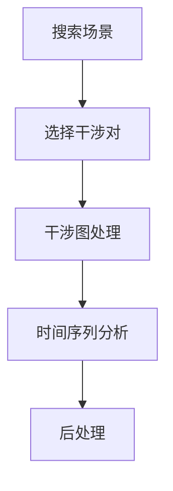

InSARHub 命令行工具（`insarhub`）将完整的处理流程——搜索、处理、分析及实用工具——集成为一个单一的命令行程序，既适合交互式使用，也适合 HPC 批处理提交。

```bash
insarhub <command> [options]
```

使用 `-v` / `--version` 检查已安装版本，在任意命令或子操作后添加 `--help` 可查看内联参考文档：

```bash
insarhub --version
insarhub --help
insarhub downloader --help
insarhub analyzer run --help
```

## 工作流程

<div style="text-align: center;">

</div>

---

## downloader

搜索卫星场景，并可选择性地进行干涉图对选择或数据下载。

```bash
insarhub downloader [options]
```

### 下载器选择

| 标志 | 默认值 | 描述 |
|------|---------|-------------|
| `-N`, `--name` | `S1_SLC` | 要使用的下载器（参见 `--list-downloaders`） |
| `--list-downloaders` | — | 打印所有已注册的下载器并退出 |
| `--list-options` | — | 打印所选下载器的所有配置字段 |
| `-w`, `--workdir` | cwd | 工作目录 |
| `--config` | `<workdir>/insarhub_config.json` | 保存的下载器配置 JSON 文件路径；省略该值则使用默认路径 |

```bash
# 列出可用的下载器
insarhub downloader --list-downloaders

# 列出 S1_SLC 的所有配置字段（如存在已保存的配置则读取）
insarhub downloader -N S1_SLC --list-options
```

首次运行后，`workdir` 中会生成一个包含完整解析配置的 `insarhub_config.json`。后续运行时，该文件会自动作为默认值加载——因此只需指定发生变化的部分：

```bash
# 首次运行：需要提供完整选项
insarhub downloader -N S1_SLC --AOI -113.05 37.74 -112.68 38.00 \
    --start 2020-01-01 --end 2020-12-31 --stacks 100:466 -w /data/bryce

# 后续运行：从 /data/bryce/insarhub_config.json 重新加载配置
insarhub downloader -N S1_SLC -w /data/bryce

# 使用不同的配置文件
insarhub downloader -w /data/bryce --config /other/path/my_config.json

# 不指定值，直接加载默认配置路径
insarhub downloader -N S1_SLC --config
```

`--list-options` 显示的任何配置字段均可直接作为额外标志设置：

```bash
insarhub downloader -N S1_SLC --start 2020-01-01 --end 2020-12-31 \
    --relativeOrbit 100 --frame 466
```

### 兴趣区域

| 标志 | 描述 |
|------|-------------|
| `--AOI` | 以 `minlon minlat maxlon maxlat` 表示的边界框，或 GeoJSON/shapefile 路径，或 WKT 字符串 |
| `--stacks` | 以 `PATH:FRAME` 格式限制到特定轨道/帧堆叠 |

```bash
# 边界框
insarhub downloader --AOI -113.05 37.74 -112.68 38.00

# 特定堆叠（优先于 --relativeOrbit / --frame）
insarhub downloader --stacks 100:466 20:118
```

### 干涉对选择

添加 `--select-pairs` 可在搜索后运行干涉图对选择。结果以 `stack_p<path>_f<frame>.json` 的形式保存在 `workdir` 下 `p<path>_f<frame>/` 子文件夹中，同时保存包含下载器设置的 `insarhub_config.json`。每个轨道/帧组对应一个文件。传入 `--merge`（见下方[合并多个帧](#merging-multiple-frames)）可将同一轨道的多个帧合并为一个配对网络。

| 标志 | 默认值 | 描述 |
|------|---------|-------------|
| `--select-pairs` | — | 搜索后选择干涉对 |
| `--dt-targets` | `6 12 24 36 48 72 96` | 目标时间间隔（天） |
| `--dt-tol` | `3` | 各目标时间间隔的容差（天） |
| `--dt-max` | `120` | 最大时间基线（天） |
| `--pb-max` | `150.0` | 最大垂直基线（米） |
| `--min-degree` | `3` | 每个场景的最小连接数 |
| `--max-degree` | `5` | 每个场景的最大连接数 |
| `--force-connect` / `--no-force-connect` | 已启用 | 强制连接孤立场景 |
| `--sp-workers` | `8` | API 基线回退的线程数 |
| `--avoid-low-quality-days` / `--no-avoid-low-quality-days` | 已启用 | 排除降雨量大或积雪覆盖的场景 |
| `--precip-mm-threshold` | `25.0` | 3 天降水阈值（毫米），超过该值的场景将被排除 |
| `--snow-threshold` | `0.5` | MODIS 积雪覆盖比例（0–1），超过该值的场景将被排除 |
| `--pairs-output` | `<workdir>/pairs.json` | 输出文件路径 |

```bash
insarhub downloader -N S1_SLC \
    --AOI -113.05 37.74 -112.68 38.00 \
    --start 2020-01-01 --end 2020-12-31 \
    --stacks 100:466 \
    --select-pairs --dt-max 96 --pb-max 150
```

### 下载

| 标志 | 默认值 | 描述 |
|------|---------|-------------|
| `-d`, `--download` | — | 搜索后下载场景 |
| `-O`, `--orbit-files [PATH]` | — | 下载轨道文件。省略 `PATH` 则保存在场景旁边（每个堆叠一个子文件夹）；提供 `PATH` 则将所有轨道文件收集到该目录 |
| `--merge` | — | 将同一相对轨道（path）的所有帧合并为一个堆叠 — 见下方[合并多个帧](#merging-multiple-frames) |
| `--worker` | `3` | 并行下载工作线程数 |
| `--no-verify-ssl` | — | 禁用 ASF 下载的 SSL 证书验证。当 ASF 证书过期导致下载失败时使用 |
| `--footprint` | `<workdir>/footprint.png` | 将覆盖范围地图图像保存到此路径 |

```bash
# 搜索、选择干涉对，并下载（轨道文件按堆叠保存）
insarhub downloader -N S1_SLC \
    --AOI -113.05 37.74 -112.68 38.00 \
    --start 2020-01-01 --end 2020-12-31 \
    --select-pairs --download -O \
    --footprint footprint.png

# 将所有轨道文件保存到指定目录
insarhub downloader -N S1_SLC \
    --AOI -113.05 37.74 -112.68 38.00 \
    --start 2020-01-01 --end 2020-12-31 \
    --download -O orbits/

# 仅下载轨道文件（不下载场景）
insarhub downloader -N S1_SLC \
    --AOI -113.05 37.74 -112.68 38.00 \
    --start 2020-01-01 --end 2020-12-31 \
    -O orbits/
```

### 合并多个帧 {#merging-multiple-frames}

当研究区域跨越同一相对轨道上的多个 ASF 帧编号时——例如某个帧存在缺口或数据质量较差，需要相邻帧来填补研究区域——可在 `--select-pairs` 和 `--download` 中同时传入 `--merge`。干涉配对仅在同一轨道内才具有物理意义：来自不同相对轨道的两次采集成像几何不同，永远无法配对，因此 `--merge` 要求所有返回的堆叠必须属于同一 path，否则会报错。

```bash
insarhub downloader -N S1_SLC \
    --AOI -113.20 37.74 -112.50 38.10 \
    --start 2020-01-01 --end 2020-12-31 \
    --select-pairs --download -O --merge
```

共享同一日历采集日期的多个帧（即同一次轨道过境被 ASF 按帧边界拆分）在配对选择时会被视为单次采集——这与 ISCE2 `stackSentinel` 内部合并同日期 SLC 的方式一致。输出保存在 `p<path>_merged_f<frame1>_f<frame2>_.../` 中——帧编号被编码进文件夹名称，因此同一轨道上两个独立的合并组（例如同一轨道的两个不同子区域）永远不会互相冲突。

---

## processor

将干涉图对提交至处理后端并管理作业生命周期。

```bash
insarhub processor [--list-processors] <action> [options]
```

| 标志 | 描述 |
|------|-------------|
| `--list-processors` | 打印所有已注册的处理器并退出 |

=== "Hyp3_S1"

    通过 ASF HyP3 进行云处理——无需本地安装 ISCE2。

    #### submit

    将干涉图对提交至 ASF HyP3 进行云处理。

    ```bash
    insarhub processor submit [options]
    ```

    | 标志 | 默认值 | 描述 |
    |------|---------|-------------|
    | `-N`, `--name` | `Hyp3_S1` | 必须为 `Hyp3_S1`（默认） |
    | `--list-options` | — | 打印所有配置字段 |
    | `-w`, `--workdir` | cwd | 工作目录 |
    | `--config` | `<workdir>/insarhub_config.json` | 已保存配置的路径；省略值则使用默认路径 |
    | `--credential-pool` | `~/.credit_pool` | 每行一条 `username:password` 的纯文本文件，用于多账户提交 |
    | `--name-prefix` | `ifg` | 作业名称前缀 |
    | `--worker` | `4` | 并行提交工作线程数 |
    | `--dry-run` | — | 打印将要提交的内容，但不实际发送作业 |
    | `--pairs-file` | 自动 | 来自 `downloader --select-pairs` 的干涉对 JSON |
    | `--pairs` | — | 以 `"reference,secondary"` 字符串内联指定干涉对 |

    提交后，设置将保存到 `insarhub_config.json`。后续运行会自动重新加载——只需指定覆盖项：

    ```bash
    # 首次提交
    insarhub processor submit -N Hyp3_S1 -w /data/bryce

    # 演习运行（建议在首次真实提交前执行）
    insarhub processor submit -N Hyp3_S1 -w /data/bryce --dry-run

    # 覆盖某个字段并重新提交
    insarhub processor submit -N Hyp3_S1 -w /data/bryce --phase_filter_parameter 0.5 --dry-run

    # 自动从 p*_f* 子文件夹中检测干涉对
    insarhub processor submit -w /data/bryce --dry-run

    # 指定干涉对文件
    insarhub processor submit -w /data/bryce --pairs-file /data/pairs.json

    # 内联干涉对
    insarhub processor submit -w /data/bryce --pairs "S1A_20200101,S1A_20200113"
    ```

    当未指定 `--pairs-file` 时，`submit` 会自动在 `workdir` 下 `p<path>_f<frame>/` 子文件夹中查找 `stack_p<path>_f<frame>.json` 文件（即 `downloader --select-pairs` 产生的目录结构）。

    #### refresh

    从 HyP3 拉取最新的作业状态。

    | 标志 | 默认值 | 描述 |
    |------|---------|-------------|
    | `-w`, `--workdir` | cwd | 工作目录 |
    | `--job-file` | `<workdir>/hyp3_jobs.json` | 已保存作业 ID JSON 文件路径 |
    | `-r`, `--recursive` | 关闭 | 递归搜索 workdir 下所有 `hyp3*.json` 文件（含重试文件） |

    ```bash
    insarhub processor refresh -w /data/bryce
    insarhub processor refresh -w /data/bryce -r   # 递归搜索所有子目录及重试文件
    ```

    #### download

    下载所有已完成的 HyP3 输出结果。

    | 标志 | 默认值 | 描述 |
    |------|---------|-------------|
    | `-w`, `--workdir` | cwd | 工作目录 |
    | `--job-file` | `<workdir>/hyp3_jobs.json` | 已保存作业 ID JSON 文件路径 |
    | `--worker` | 已保存配置 | 并行下载线程数（覆盖已保存配置） |
    | `-r`, `--recursive` | 关闭 | 递归搜索 workdir 下所有 `hyp3*.json` 文件（含重试文件） |

    ```bash
    insarhub processor download -w /data/bryce
    insarhub processor download -w /data/bryce -r --worker 8
    ```

    #### retry

    重新提交所有失败的 HyP3 作业。

    | 标志 | 默认值 | 描述 |
    |------|---------|-------------|
    | `-w`, `--workdir` | cwd | 工作目录 |
    | `--job-file` | 自动 | 已保存的作业文件 |
    | `-r`, `--recursive` | 关闭 | 递归搜索 workdir 下所有 `hyp3*.json` 文件（含重试文件） |

    ```bash
    insarhub processor retry -w /data/bryce
    insarhub processor retry -w /data/bryce -r
    ```

    #### watch

    定期轮询 HyP3；在作业成功后自动下载结果。

    | 标志 | 默认值 | 描述 |
    |------|---------|-------------|
    | `--interval` | `300` | 轮询间隔（秒） |
    | `-w`, `--workdir` | cwd | 工作目录 |
    | `--worker` | 已保存配置 | 并行下载线程数（覆盖已保存配置） |
    | `-r`, `--recursive` | 关闭 | 递归搜索 workdir 下所有 `hyp3*.json` 文件（含重试文件） |

    ```bash
    insarhub processor watch -w /data/bryce --interval 600
    insarhub processor watch -w /data/bryce --interval 600 -r
    insarhub processor watch -w /data/bryce --worker 8
    ```

    #### credits

    显示所有账户剩余的 HyP3 处理配额。

    | 标志 | 默认值 | 描述 |
    |------|---------|-------------|
    | `--credential-pool` | `~/.credit_pool` | 每行一条 `username:password` 的纯文本文件，用于多账户 |

    ```bash
    insarhub processor credits
    insarhub processor credits --credential-pool ~/.credit_pool
    ```

=== "ISCE_S1"

    使用 ISCE2 `stackSentinel` 进行本地或 HPC 处理——需要安装 ISCE2。必须先下载 SLC `.SAFE` 文件（使用 `insarhub downloader -d`）。

    #### submit

    生成 ISCE2 运行脚本并启动执行。

    ```bash
    insarhub processor submit -N ISCE_S1 [options]
    ```

    | 标志 | 默认值 | 描述 |
    |------|---------|-------------|
    | `-N`, `--name` | — | 必须为 `ISCE_S1` |
    | `--list-options` | — | 打印所有配置字段 |
    | `-w`, `--workdir` | cwd | 工作目录 |
    | `--config` | `<workdir>/insarhub_config.json` | 已保存配置的路径 |
    | `--bbox` | — | 十进制度表示的边界框 `S N W E` |
    | `--slc_dir` | `<workdir>/slc` | 包含 SLC `.SAFE` 文件的目录 |
    | `--orbit_dir` | `<workdir>/slc` | 包含 `.EOF` 轨道文件的目录 |
    | `--hpc_mode` | `False` | 将每个步骤作为独立的 SLURM `sbatch` 作业提交 |
    | `--max_concurrent_hpc` | `12` | 每个步骤中同时运行的最大子作业数 |
    | `--coregistration` | `NESD` | `NESD`（推荐）或 `geometry` |
    | `--looks_range` | `20` | 距离向视数 |
    | `--looks_azimuth` | `4` | 方位向视数 |
    | `--step` | 全部 | 无论已保存状态如何，强制（重新）运行这些步骤 — 见下方说明 |
    | `--dry-run` | — | 预览运行脚本和路径检查，不实际执行 |
    | `--pairs-file` | 自动 | 来自 `downloader --select-pairs` 的干涉对 JSON |
    | `--container` | — | 在容器内而非本机运行 — 见下方[无需本地安装 ISCE2](#running-without-a-local-isce2-install) |

    ```bash
    # 先进行演习运行（推荐）
    insarhub processor submit -N ISCE_S1 -w /data/p100_f466 \
        --bbox 33.0 38.0 -120.0 -115.0 --dry-run

    # 本地执行（在后台运行）
    insarhub processor submit -N ISCE_S1 -w /data/p100_f466 \
        --bbox 33.0 38.0 -120.0 -115.0

    # HPC / SLURM 模式
    insarhub processor submit -N ISCE_S1 -w /data/p100_f466 \
        --bbox 33.0 38.0 -120.0 -115.0 --hpc_mode True
    ```

    !!! note "使用 `--step` 强制重新运行指定步骤"
        普通 `submit` 会跳过已 `SUCCEEDED` 的步骤；`retry` 从第一个 `FAILED` 步骤开始重新运行，并级联到其后所有步骤。`--step` 比两者都更精细：它只强制把指定步骤重置为 `PENDING` 并重新运行，其余步骤保持原样 — 不会级联。适用于某个步骤悄悄产生了错误输出（却被记录为 `SUCCEEDED`），只需重做那一个步骤的场景。

        接受完整步骤名、纯数字编号或 `run_NN` 前缀：

        ```bash
        # 强制重新运行步骤 03 — 以下写法等价
        insarhub processor submit -N ISCE_S1 -w /data/p100_f466 --step 03
        insarhub processor submit -N ISCE_S1 -w /data/p100_f466 --step 3
        insarhub processor submit -N ISCE_S1 -w /data/p100_f466 --step run_03

        # 强制重新运行多个步骤
        insarhub processor submit -N ISCE_S1 -w /data/p100_f466 --step 03 04 05
        ```

        在 HPC 模式下，这还会清除被强制步骤的过期单命令 `.done`/`.fail` 标记文件 — 否则管理器脚本会看到旧标记并报告"已完成"而不实际提交任何作业。

    !!! note "HPC 模式 — 滑动窗口管理器"
        设置 `--hpc_mode True` 后，每个处理步骤都通过轻量级 SLURM **管理器作业**运行。管理器随时保持最多 `--max_concurrent_hpc` 个子作业同时活跃，有空槽时立即补充新作业。步骤之间通过 `--dependency=afterok` 自动串联。命令数相同的连续步骤会自动合并为单个组管理器作业。

        每个 sbatch 脚本会按命令记录带耗时秒数的 `START`、`DONE`、`FAIL` 日志行。

        **`sbatch_options.json`** — 从 `<workdir>/sbatch_options.json` 自动加载，用于配置各步骤的 SLURM 资源（CPU、内存、墙钟时间、分区等）。步骤 `"01"`–`"16"` 是 `ISCE_S1` 自身的步骤；步骤 `"17"`（"SBAS"）用于配置 `ISCE_SBAS`/`Hyp3_SBAS` 分析器自身的 `--hpc_mode` 作业 — 由于处理器和分析器通常共用同一工作目录，两者共享同一个文件。

        - 若**未找到** `sbatch_options.json`，将创建覆盖步骤 `01`–`17` 的默认模板，并提示重新提交前先编辑该文件。
        - 若文件已存在但缺少即将用到的步骤（例如首次以 HPC 模式运行分析器时缺少 `"17"`），会自动补充默认资源、重写文件并打印警告 — 使用前请检查这些默认值。
        - 若存在旧版运行的 `srun_options.json`，将自动迁移为 `sbatch_options.json`。

        编辑 `sbatch_options.json` 以设置每个步骤的资源，然后重新运行 `submit`。

    !!! note "无需本地安装 ISCE2"
        `--container <path-or-image>` 会将整个 `insarhub processor ...` 命令重新在容器内执行，而不是在本机运行 — 传入 Apptainer/Singularity `.sif` 镜像的路径，或 Docker 镜像引用（name[:tag]）。工作目录会以相同路径绑定挂载到容器内，因此输出文件会像本机运行一样落在宿主机上，`ISCE_S1` 也完全不需要在宿主机上发现 ISCE2 安装。容器镜像只需在 ISCE2/topsStack 旁额外安装 `insarhub` 即可 — 可参考仓库根目录的 [`Dockerfile`](https://github.com/jldz9/InSARHub/blob/main/Dockerfile) 作为现成示例。

        ```bash
        insarhub processor submit  -N ISCE_S1 -w /data/p100_f466 --bbox 33.0 38.0 -120.0 -115.0 --container ghcr.io/jldz9/insarhub-isce2:latest
        insarhub processor refresh -N ISCE_S1 -w /data/p100_f466 --container ghcr.io/jldz9/insarhub-isce2:latest
        insarhub processor retry   -N ISCE_S1 -w /data/p100_f466 --container ghcr.io/jldz9/insarhub-isce2:latest
        insarhub processor watch   -N ISCE_S1 -w /data/p100_f466 --container ghcr.io/jldz9/insarhub-isce2:latest
        insarhub processor cancel  -N ISCE_S1 -w /data/p100_f466 --container ghcr.io/jldz9/insarhub-isce2:latest
        ```

        `--container` 是按次调用的标志，而非已保存设置 — 与 `--dry-run` 一样，它不会写入 `insarhub_config.json`，因此每次想在容器内运行 `submit`/`refresh`/`retry`/`watch`/`cancel` 时都需要再次传入。

    #### refresh

    从磁盘读取步骤和命令状态。

    | 标志 | 默认值 | 描述 |
    |------|---------|-------------|
    | `-w`, `--workdir` | cwd | 工作目录 |
    | `--job-file` | 自动 | `<workdir>/isce/isce_jobs_*.json` |
    | `--ls [STEP]` | 关闭 | 显示单条命令（`cmd_XXXX`）详情 — 单独 `--ls` 显示所有步骤，`--ls 03`（也可写 `3` 或 `run_03`）只显示该步骤 |
    | `--container` | — | 若宿主机未安装本地 ISCE2 则需要此项 — 见[上方说明](#running-without-a-local-isce2-install) |

    ```bash
    insarhub processor refresh -N ISCE_S1 -w /data/p100_f466
    ```

    默认只打印每个步骤一行的摘要 — 不含 `cmd_XXXX` 详情：

    ??? output
        ```
          STEP                                          STATUS
        -----------------------------------------------------------------
          - run_01_unpack_topo_reference                SUCCEEDED
          - run_02_unpack_secondary_slc                 RUNNING
          - run_03_average_baseline                     PENDING
          ...
        ```

    传入 `--ls` 可查看单条命令详情 — 所有步骤，或指定某一步骤：

    ```bash
    insarhub processor refresh -N ISCE_S1 -w /data/p100_f466 --ls        # 所有步骤
    insarhub processor refresh -N ISCE_S1 -w /data/p100_f466 --ls 02     # 仅 run_02
    ```

    ??? output
        ```
          STEP                                          STATUS
        -----------------------------------------------------------------
          - run_01_unpack_topo_reference                SUCCEEDED
          - run_02_unpack_secondary_slc                 RUNNING
              cmd_0000  SUCCEEDED
              cmd_0001  RUNNING
              cmd_0002  PENDING
          - run_03_average_baseline                     PENDING
          ...
        ```

    #### retry

    重新运行所有失败的步骤。HPC 模式会从已保存的作业元数据中自动检测，无需再次传入 `--hpc_mode`。

    | 标志 | 默认值 | 描述 |
    |------|---------|-------------|
    | `-w`, `--workdir` | cwd | 工作目录 |
    | `--job-file` | 自动 | 已保存的作业文件 |
    | `--container` | — | 若宿主机未安装本地 ISCE2 则需要此项 — 见[上方说明](#running-without-a-local-isce2-install) |

    ```bash
    insarhub processor retry -N ISCE_S1 -w /data/p100_f466
    ```

    #### cancel

    终止正在运行的步骤。本地模式向后台进程发送 SIGTERM；HPC 模式对所有活跃的 SLURM 作业 ID 运行 `scancel`。

    | 标志 | 默认值 | 描述 |
    |------|---------|-------------|
    | `-w`, `--workdir` | cwd | 工作目录 |
    | `--job-file` | 自动 | 已保存的作业文件 |
    | `--container` | — | 若宿主机未安装本地 ISCE2 则需要此项 — 见[上方说明](#running-without-a-local-isce2-install) |

    ```bash
    insarhub processor cancel -N ISCE_S1 -w /data/p100_f466
    ```

    #### watch

    轮询步骤状态，直到所有步骤完成。

    | 标志 | 默认值 | 描述 |
    |------|---------|-------------|
    | `--interval` | `300` | 轮询间隔（秒） |
    | `-w`, `--workdir` | cwd | 工作目录 |
    | `--container` | — | 若宿主机未安装本地 ISCE2 则需要此项 — 见[上方说明](#running-without-a-local-isce2-install) |

    ```bash
    insarhub processor watch -N ISCE_S1 -w /data/p100_f466 --interval 120
    ```

---

## analyzer

对干涉图输出运行 MintPy SBAS 时间序列分析。

```bash
insarhub analyzer [-N ANALYZER] [-w WORKDIR] [config overrides] <action> [options]
```

| 标志 | 默认值 | 描述 |
|------|---------|-------------|
| `-N`, `--name` | `Hyp3_SBAS` | 要使用的分析器（`Hyp3_SBAS` 或 `ISCE_SBAS`） |
| `-w`, `--workdir` | cwd | 工作目录 |
| `--list-analyzers` | — | 打印所有已注册的分析器并退出 |
| `--list-options` | — | 打印所选分析器的所有配置字段 |

| 分析器 | 处理器 | 输入 |
|---|---|---|
| `Hyp3_SBAS` | [`Hyp3_S1`](#hyp3_s1) | HyP3 zip 输出 |
| `ISCE_SBAS` | [`ISCE_S1`](#isce_s1) | ISCE2 `merged/interferograms/` |

`--list-options` 显示的任何字段均可在操作前通过命令行覆盖。值会写入 `mintpy.cfg` 并在运行间持久保存。若 `workdir` 包含多个 `p*_f*` 子文件夹，覆盖和分析将依次应用于每个文件夹。

=== "Hyp3_SBAS"

    ### run

    运行分析工作流。省略 `--step` 则运行完整流程（`prep_data` + 所有 MintPy 步骤）。

    ```bash
    insarhub analyzer -N Hyp3_SBAS -w /data/bryce run [--step STEP...] [--debug]
    ```

    | 标志 | 默认值 | 描述 |
    |------|---------|-------------|
    | `--step` | all | 要运行的步骤（空格分隔） |
    | `--debug` | — | 启用 MintPy 调试模式 |
    | `--hpc_mode` | `False` | 将完整 MintPy 流程作为单个 SLURM `sbatch` 作业提交，而非本地运行 |
    | `--container` | — | 在容器内而非本机运行 — 需要在容器内额外安装 `insarhub`（`ISCE_SBAS` 还需要 ISCE2）；机制与 [ISCE_S1 的容器说明](#running-without-a-local-isce2-install)相同 |

    | 步骤关键字 | 描述 |
    |---|---|
    | `prep_data` | 解压/裁剪 HyP3 产品，写入 MintPy 配置 |
    | `all` | `prep_data` + 所有 MintPy 步骤（默认） |
    | `load_data` | 将干涉图和几何数据加载到 MintPy HDF5 中 |
    | `modify_network` | 应用网络修改规则 |
    | `reference_point` | 选择参考像素 |
    | `quick_overview` | 生成诊断概览图层（相干性、相位速度、解缠误差、连通分量掩模） |
    | `correct_unwrap_error` | 校正相位解缠错误 |
    | `invert_network` | 反演干涉图网络（SBAS） |
    | `correct_LOD` | 校正本地振荡器漂移 |
    | `correct_SET` | 校正固体地球潮汐 |
    | `correct_ionosphere` | 校正电离层延迟 |
    | `correct_troposphere` | 校正对流层延迟 |
    | `deramp` | 去除轨道/坡道信号 |
    | `correct_topography` | 校正地形残差 |
    | `residual_RMS` | 计算残差 RMS 用于异常值检测 |
    | `reference_date` | 选择参考日期 |
    | `velocity` | 估算线性速度 |
    | `geocode` | 将输出地理编码为地理坐标 |
    | `google_earth` | 生成 Google Earth KMZ 文件 |
    | `hdfeos5` | 导出为 HDF-EOS5 格式 |
    | `plot` | （重新）生成 `mintpy/pic/` 下的图片。不是真正的 MintPy 步骤 — 由特殊逻辑处理。只要请求了一个以上的真实步骤（或完整的 `all` 流程）就会自动追加，行为与 MintPy 自身的 CLI 一致；也可单独使用（例如修改配置后只重新生成图片而不重新计算） |

    ```bash
    # 完整流程
    insarhub analyzer -N Hyp3_SBAS -w /data/bryce run

    # 仅执行 prep
    insarhub analyzer -N Hyp3_SBAS -w /data/bryce run --step prep_data

    # 单个步骤
    insarhub analyzer -N Hyp3_SBAS -w /data/bryce run --step velocity

    # 多个步骤
    insarhub analyzer -N Hyp3_SBAS -w /data/bryce run --step geocode velocity

    # 覆盖配置并运行
    insarhub analyzer -N Hyp3_SBAS -w /data/bryce --compute_maxMemory 30 run
    ```

    每个正在执行的步骤会打印 `Step N/Total: step_name`，便于批处理日志查看。

    #### HPC 模式

    设置 `--hpc_mode True` 后，生成一个涵盖所有选定步骤的单个 `sbatch` 脚本并提交至 SLURM，而非本地运行。

    ```bash
    insarhub analyzer -N Hyp3_SBAS -w /data/bryce run --hpc_mode True

    # 仅在 HPC 上运行特定步骤
    insarhub analyzer -N Hyp3_SBAS -w /data/bryce run --hpc_mode True --step velocity geocode
    ```

    脚本写入 `<workdir>/mintpy/mintpy_sbas.sbatch`，作业状态保存至 `mintpy/mintpy_job.json`。

    SLURM 资源来自 `<workdir>/sbatch_options.json` 的 `"17"` 步骤键 — 与 `ISCE_S1 submit --hpc_mode`（步骤 `01`–`16`）**使用同一个文件**，因为处理器和分析器通常共用同一工作目录。默认值：`time=24:00:00`、`ntasks=1`、`cpus_per_task=16`、`mem=128G`、`partition=all`。

    - 若 `sbatch_options.json` 尚不存在，将创建（覆盖步骤 `01`–`17`）并停止运行，以便重新提交前先检查该文件。
    - 若文件已存在但没有 `"17"` 条目，将自动补充上述默认值，打印警告，然后继续运行。

    编辑 `sbatch_options.json` 中的 `"17"` 步骤以更改资源，然后重新运行：

    ```bash
    insarhub analyzer -N Hyp3_SBAS -w /data/bryce run --hpc_mode True
    ```

    ### cleanup

    删除 MintPy 将所有数据加载到 HDF5 后不再需要的中间文件和目录。

    ```bash
    insarhub analyzer -N Hyp3_SBAS -w /data/bryce cleanup
    ```

    | 标志 | 描述 |
    |------|-------------|
    | `--debug` | 演习运行——打印将要删除的内容，不实际删除 |

    删除内容：`tmp/`、`clip/`、workdir 中所有 `.zip` 文件。

=== "ISCE_SBAS"

    ### run

    运行分析工作流。省略 `--step` 则运行完整流程（`prep_data` + 所有 MintPy 步骤）。

    ```bash
    insarhub analyzer -N ISCE_SBAS -w /data/p100_f466 run [--step STEP...] [--debug]
    ```

    | 标志 | 默认值 | 描述 |
    |------|---------|-------------|
    | `--step` | all | 要运行的步骤（空格分隔） |
    | `--debug` | — | 启用 MintPy 调试模式 |
    | `--hpc_mode` | `False` | 将完整 MintPy 流程作为单个 SLURM `sbatch` 作业提交，而非本地运行 |
    | `--container` | — | 在容器内而非本机运行 — 需要在容器内额外安装 `insarhub`（`ISCE_SBAS` 还需要 ISCE2）；机制与 [ISCE_S1 的容器说明](#running-without-a-local-isce2-install)相同 |

    | 步骤关键字 | 描述 |
    |---|---|
    | `prep_data` | 自动发现 ISCE2 输出，写入 MintPy 配置 |
    | `all` | `prep_data` + 所有 MintPy 步骤（默认） |
    | `load_data` | 将干涉图和几何数据加载到 MintPy HDF5 中 |
    | `modify_network` | 应用网络修改规则 |
    | `reference_point` | 选择参考像素 |
    | `quick_overview` | 生成诊断概览图层（相干性、相位速度、解缠误差、连通分量掩模） |
    | `correct_unwrap_error` | 校正相位解缠错误 |
    | `invert_network` | 反演干涉图网络（SBAS） |
    | `correct_LOD` | 校正本地振荡器漂移 |
    | `correct_SET` | 校正固体地球潮汐 |
    | `correct_ionosphere` | 校正电离层延迟 |
    | `correct_troposphere` | 校正对流层延迟 |
    | `deramp` | 去除轨道/坡道信号 |
    | `correct_topography` | 校正地形残差 |
    | `residual_RMS` | 计算残差 RMS 用于异常值检测 |
    | `reference_date` | 选择参考日期 |
    | `velocity` | 估算线性速度 |
    | `geocode` | 将输出地理编码为地理坐标 |
    | `google_earth` | 生成 Google Earth KMZ 文件 |
    | `hdfeos5` | 导出为 HDF-EOS5 格式 |
    | `plot` | （重新）生成 `mintpy/pic/` 下的图片。不是真正的 MintPy 步骤 — 由特殊逻辑处理。只要请求了一个以上的真实步骤（或完整的 `all` 流程）就会自动追加，行为与 MintPy 自身的 CLI 一致；也可单独使用（例如修改配置后只重新生成图片而不重新计算） |

    ```bash
    # 完整流程
    insarhub analyzer -N ISCE_SBAS -w /data/p100_f466 run

    # 仅执行 prep
    insarhub analyzer -N ISCE_SBAS -w /data/p100_f466 run --step prep_data

    # 单个步骤
    insarhub analyzer -N ISCE_SBAS -w /data/p100_f466 run --step velocity

    # 多个步骤
    insarhub analyzer -N ISCE_SBAS -w /data/p100_f466 run --step geocode velocity

    # 覆盖配置并运行
    insarhub analyzer -N ISCE_SBAS -w /data/p100_f466 --compute_maxMemory 30 run
    ```

    每个正在执行的步骤会打印 `Step N/Total: step_name`，便于批处理日志查看。

    #### HPC 模式

    设置 `--hpc_mode True` 后，生成一个涵盖所有选定步骤的单个 `sbatch` 脚本并提交至 SLURM，而非本地运行。

    ```bash
    insarhub analyzer -N ISCE_SBAS -w /data/p100_f466 run --hpc_mode True

    # 仅在 HPC 上运行特定步骤
    insarhub analyzer -N ISCE_SBAS -w /data/p100_f466 run --hpc_mode True --step velocity geocode
    ```

    脚本写入 `<workdir>/mintpy/mintpy_sbas.sbatch`，作业状态保存至 `mintpy/mintpy_job.json`。

    SLURM 资源来自 `<workdir>/sbatch_options.json` 的 `"17"` 步骤键 — 与 `ISCE_S1 submit --hpc_mode`（步骤 `01`–`16`）**使用同一个文件**，因为处理器和分析器通常共用同一工作目录。默认值：`time=24:00:00`、`ntasks=1`、`cpus_per_task=16`、`mem=128G`、`partition=all`。

    - 若 `sbatch_options.json` 尚不存在，将创建（覆盖步骤 `01`–`17`）并停止运行，以便重新提交前先检查该文件。
    - 若文件已存在但没有 `"17"` 条目，将自动补充上述默认值，打印警告，然后继续运行。

    编辑 `sbatch_options.json` 中的 `"17"` 步骤以更改资源，然后重新运行：

    ```bash
    insarhub analyzer -N ISCE_SBAS -w /data/p100_f466 run --hpc_mode True
    ```

    ### cleanup

    删除 MintPy 将所有数据加载到 HDF5 后不再需要的中间文件和目录。

    ```bash
    insarhub analyzer -N ISCE_SBAS -w /data/p100_f466 cleanup
    ```

    | 标志 | 描述 |
    |------|-------------|
    | `--debug` | 演习运行——打印将要删除的内容，不实际删除 |

    删除内容：`isce/coarse_interferograms/`、`isce/ESD/`、`isce/coreg_secondarys/`、`isce/interferograms/`、`slc/`、`dem/`。

---

## utils

用于数据准备、干涉对选择、网络可视化和 HPC 作业生成的独立实用工具。

```bash
insarhub utils <tool> [options]
```

### clip

在运行 MintPy 之前，将 HyP3 zip 文件内容裁剪到兴趣区域。适用于场景范围远超研究区域的情况。

```bash
insarhub utils clip -w /data/bryce --aoi -113.05 37.74 -112.68 38.00
insarhub utils clip -w /data/bryce --aoi study_area.geojson
```

| 标志 | 默认值 | 描述 |
|------|---------|-------------|
| `-w`, `--workdir` | cwd | 包含 HyP3 `.zip` 文件的目录 |
| `--aoi` | 必填 | AOI 以 `minlon minlat maxlon maxlat` 表示，或 GeoJSON/shapefile 路径 |

### h5-to-raster

将 MintPy HDF5 输出文件（如 `velocity.h5`）转换为 GeoTIFF。

```bash
insarhub utils h5-to-raster -i velocity.h5
insarhub utils h5-to-raster -i velocity.h5 -o velocity.tif
```

| 标志 | 默认值 | 描述 |
|------|---------|-------------|
| `-i`, `--input` | 必填 | 输入 HDF5 文件 |
| `-o`, `--output` | 与输入同名，扩展名改为 `.tif` | 输出 GeoTIFF 路径 |

### save-footprint

从栅格中提取有效数据覆盖范围多边形，并保存为矢量文件。

```bash
insarhub utils save-footprint -i velocity.h5
insarhub utils save-footprint -i velocity.h5 -o footprint.geojson
```

| 标志 | 默认值 | 描述 |
|------|---------|-------------|
| `-i`, `--input` | 必填 | 输入栅格文件 |
| `-o`, `--output` | 自动命名在输入文件旁 | 输出矢量文件路径 |

### slurm

生成用于在 HPC 集群上运行 `insarhub` 流程的 SLURM 批处理脚本。

```bash
insarhub utils slurm \
    --job-name insar_bryce \
    --time 08:00:00 \
    --cpus 16 \
    --mem 64G \
    --partition compute \
    --conda-env insarhub \
    --command "insarhub analyzer -N Hyp3_SBAS -w /data/bryce run" \
    -o bryce.slurm
```

| 标志 | 默认值 | 描述 |
|------|---------|-------------|
| `--job-name` | `insarhub_job` | SLURM 作业名称 |
| `--time` | `04:00:00` | 墙钟时间限制（`HH:MM:SS`） |
| `--partition` | `all` | SLURM 分区 |
| `--nodes` | `1` | 节点数量 |
| `--ntasks` | `1` | 任务数量 |
| `--cpus` | `8` | 每个任务的 CPU 数 |
| `--mem` | `32G` | 每节点内存 |
| `--gpus` | — | GPU 分配，例如 `1` 或 `2` |
| `--conda-env` | — | 要激活的 Conda 环境 |
| `--modules` | — | 要加载的空格分隔环境模块 |
| `--mail-user` | — | 作业通知的电子邮件地址 |
| `--mail-type` | `ALL` | 通知时机：`BEGIN`、`END`、`FAIL` 或 `ALL` |
| `--account` | — | 用于计费的账户 |
| `--qos` | — | 服务质量规范 |
| `--command` | 必填 | 在作业内执行的 Shell 命令 |
| `-o`, `--output` | `job.slurm` | 输出脚本路径 |

生成的脚本遵循以下结构：

```bash
#!/bin/bash
#SBATCH --job-name=insar_bryce
#SBATCH --time=08:00:00
#SBATCH --cpus-per-task=16
#SBATCH --mem=64G
...

source activate insarhub

echo "Starting job on $(date)"
insarhub analyzer -N Hyp3_SBAS -w /data/bryce run
echo "Job finished on $(date)"
```

### era5-download

下载用于 MintPy 对流层校正的 ERA5 压力层气象数据。自动扫描包含 HyP3 zip 文件的工作目录，确定所需的获取日期和空间范围，并使用 MintPy 兼容的命名规范保存文件（`ERA5_S*_N*_W*_E*_YYYYMMDD_HH.grb`）。

需要在 `~/.cdsapirc` 中提供 [CDS API](https://cds.climate.copernicus.eu/api-how-to) 凭证。

```bash
insarhub utils era5-download -w /data/bryce -o /data/era5
insarhub utils era5-download -w /data/bryce -o /data/era5 --num-processes 5
```

| 标志 | 默认值 | 描述 |
|------|---------|-------------|
| `-w`, `--workdir` | 必填 | 包含 HyP3 zip 文件的目录（按子文件夹扫描） |
| `-o`, `--output` | 必填 | ERA5 `.grb` 文件的输出目录 |
| `--num-processes` | `3` | 并行下载工作进程数 |
| `--max-retries` | `3` | 每个文件下载失败时的重试次数 |

已下载的文件会自动跳过，因此在下载中断后重新运行该命令是安全的。

---

## 端到端示例 — HyP3

使用云端 HyP3 处理的完整流程，从搜索到时间序列分析：

```bash
# 1. 搜索并选择干涉对
insarhub downloader -N S1_SLC \
    --AOI -113.05 37.74 -112.68 38.00 \
    --start 2020-01-01 --end 2020-12-31 \
    --stacks 100:466 \
    -w /data/bryce \
    --select-pairs

# 2. 将干涉图提交至 HyP3
insarhub processor submit -w /data/bryce

# 3. 等待作业完成并自动下载
insarhub processor watch -w /data/bryce

# 4. 运行时间序列分析
insarhub analyzer -N Hyp3_SBAS -w /data/bryce run

# 5. 将速度场导出为 GeoTIFF
insarhub utils h5-to-raster -i /data/bryce/p100_f466/velocity.h5
```

---

## 端到端示例 — ISCE_S1（本地）

使用本地 ISCE2 处理和 ISCE_SBAS 时间序列分析的完整流程：

```bash
# 1. 搜索并下载 SLC 场景（默认保存到 workdir/slc/）
insarhub downloader -N S1_SLC \
    --AOI -113.05 37.74 -112.68 38.00 \
    --start 2020-01-01 --end 2020-12-31 \
    --stacks 100:466 \
    -w /data/p100_f466 \
    --select-pairs --download -O

# 2. 演习运行以验证路径和 bbox
insarhub processor submit -N ISCE_S1 -w /data/p100_f466 \
    --bbox 37.74 38.00 -113.05 -112.68 --dry-run

# 3. 提交本地处理（在后台运行）
insarhub processor submit -N ISCE_S1 -w /data/p100_f466 \
    --bbox 37.74 38.00 -113.05 -112.68

# 4. 监控进度
insarhub processor refresh -N ISCE_S1 -w /data/p100_f466

# 5. 等待所有步骤完成
insarhub processor watch -N ISCE_S1 -w /data/p100_f466 --interval 120

# 6. 运行 ISCE_SBAS 时间序列分析
insarhub analyzer -N ISCE_SBAS -w /data/p100_f466 run

# 7. 将速度场导出为 GeoTIFF
insarhub utils h5-to-raster -i /data/p100_f466/mintpy/geo/geo_velocity.h5
```

*[HPC]: High Performance Computing
*[HyP3]: Hybrid Pluggable Processing Pipeline
*[ASF]: Alaska Satellite Facility
*[AOI]: Area of Interest
*[SLC]: Single Look Complex
*[SBAS]: Small Baseline Subset
